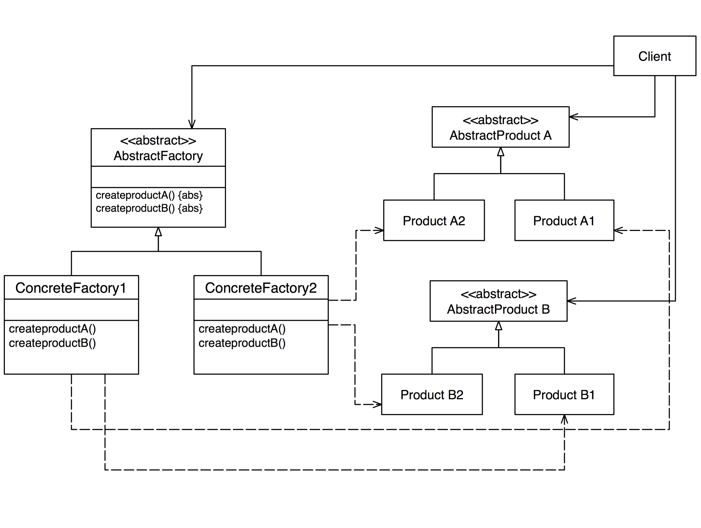

# Abstract Factory 

> 一式多款

### Intent 目的
提供一個介面物件以建立一群相關的物件，但卻不明確的指明這些物件的所屬類別，用以增加建立這些物件時的彈性。

### Motivation 動機

考慮一個Computer的物件在運作的時候需要用到 CPU、Memory、MotherBoard等零件物件。如果我們在方法*make()*中產生這些零件物件，如下:

```java
class Computer {
   void make() {
      cpu = new PC();
      memory = new Memory();
      mb = new MotherBoard();
   }
}
```

則日後Computer物件想建立不同型態的零件物件(例如工作站CPU、工作站Memory、工作站主機板)時，則必須修改op1()方法如下：

```java
cpu = new WorkStationCPU(); 
memory = new WorkStationMemory();
mb = new WorkStationMainBoard();
```

這樣的缺點是如果我們每一次有新的電腦類別產生時就必須修改程式(op1())一次。我們可以將生成這一群零件物件的的動作抽象為一個工廠類別，當日後有新的文件物件產出時，只要擴充這個工廠類別即可，不需要修改原程式的程式碼。
 
### Structure 結構



抽象生成工廠的特色是系統可以拆解分成幾個家族，每個家族內有一些相近的成員類別。上圖為抽象生成工廠的架構圖，其中ConcreteFactory1與ConcreteFactory2為兩個不同的家族，每個家族在運作時，都會用到ProductA與ProducetB等成員物件，但前者會用到ProductA1與ProductB1，而後者會用到ProductA2與ProductB2。

#### DIP 原則

Client 只會看到抽象的物件 AbstractProductA, AbstractProductB, AbstractFactory 等類別，並不會看到比較低階的 ProductA2, ProductB1 等物件，這大大的降低了 client 與這些物件的耦合力（coupling）。

另外，這也體現了『相依倒轉原則（Dependency Inversion Principle; DIP）』

#### OCP 原則
當我們有心的一組產品被開發出來，只需要透過繼承產生 ConcreteFactory3, ProductA3, ProductB3 即可，不需要修改 Client 中的程式碼。

### Participant 參與者

- 抽象工廠(AbstractFactory)：宣告一個介面，宣告生成零件物件的方法。
- 實體工廠(ConcreteFactory)：實際負責生產的物件。一個實體工廠負責生成一個家族的所有零件物件。
- 抽象產品(AbstractProduct)：宣告某項零件物件的共同性質。
- 實體產品(ConcreteProduct)：實際存在的零件類別。
- 使用者(Client)：使用者。實際需要遇到抽象工廠所產生的零件物件的物件。

### Applicability 應用時機
- 當系統的目標是生產具有許多類似的物件時，又有動態配置產品的需求時。
- 當所有生產的產品物件有一種家族系列的關係時（family of product）。

### Consequence 效益

- 抽象生成工廠最大的好處在於簡化家族間的切換。當系統想要使用某個家族類別時，只要傳入該家族類別的生成工廠即可，整個家族類別所需要的成員類別可以依序建立以供使用。比起Factory Method將生產只是包裝成一個方法，在Abstract Factory中，則是將生產包裝成一個一個的類別，更能夠表示出一個工廠生產產品的特性。

#### Example 實例
- 在迷宮系統中，一般型態的迷宮是一個家族、有魔法的迷宮是一個家族。不論是哪一種家族，都需要用到零件物件如牆壁、房間、門等。
- 在象棋系統中，長棋是一個家族、短棋是一個家族。不論是哪一種家族，都需要用到零件物件如象棋規則、象棋棋盤、棋局管理等。

### PC 範例

```java
class ComputerFactory {
   public CPU makeCPU() {
      return new CPU();
   }
   public Memory makeMemory() {
      return new Memory();
   }
   public MotherBoard makeMotherBoard() {
      return new MotherBoard();
   }
}
```

```java
class Computer {
       
   public Computer createComputer(ComputerFactory factory) {
      // 使用 factory 來產生所有的零件物件
      
      CPU cpu = factory.makeCPU();
      Memory memory = factory.makeMemory();
      MotherBoard mb = factory.makeMotherBoard();

   }   
}
```
 
``` java
class WorkstationFactory {
   public CPU makeCPU() {
      return new WorkstationCPU();
   }
   public Memory makeMemory() {
      return new WorkstationMemory();
   }
   public MotherBoard makeMotherBoard() {
      return new WorkstationMotherBoard();
   }
}
```

請注意 Workstation 的各零件是都是 Computer 的子類別

```java

	class WorkstationCPU extends CPU {... }
	class WorkstationMemory extends Memory {...}
	class WorkstationMotherBoard extends MotherBoard {...}

```

當我們想要生產 workstation 時，只要帶入 WorkstationFactory 就好了：

	ComputerFactory factory = new WorkstationFactory();
	computer.createComputer(factory);

如果要生產 PC，則帶入預設的 ComputerFactory;	

	ComputerFactory factory = new ComputerFactory();
	computer.createComputer(factory);

### Maze Example 迷宮範例

首先我們以Gamma一書所提的迷宮程式來做介紹，在之前我們用Factory Method的方法去製作另一間EnchantedRoom，EnchantedRoom本身必須要有EnchantedRoom必須的Wall和Door。但是當我們希望能夠動態搭配Wall和Door，這時候Factory Method所提供的便不夠了，我們可以改用Abstract Factory來解決這個問題。

首先我們必須宣告一個 MazeFactory，負責去宣告 makeMaze()、makeRoom()、makeWall()、makeDoor()等操作方法的介面：

```java
class MazeFactory {
   public Maze makeMaze() {
      return new Maze();
   }
   public Room makeRoom(int n) {
      return new Room(n);
   }
   public Wall makeWall() {
      return new Wall();
   }
   public Door makeDoor(Room r1, Room r2) {
      return new Door(r1, r2);
   }
}
```

然後我們製作一個 MazeGame 負責去做一個主要操作的描述

```java
class MazeGame {
   static String North="north";
   static String East="east";
   static String South="south";
   static String West="west";  
   Room r1, r2;
   Door door;
   Wall w1, w2, w3, w4, w5, w6;  
       
   MazeFactory factory;
   public Maze createMaze() {
      // use factory to create all products  	
      Maze maze = factory.makeMaze();
      r1 = factory.makeRoom(1);
      r2 = factory.makeRoom(2);      
      door = factory.makeDoor(r1, r2);
      w1 = factory.makeWall();
      w2 = factory.makeWall();
      w3 = factory.makeWall(); 
      w4 = factory.makeWall();
      w5 = factory.makeWall();
      w6 = factory.makeWall();

      // communication between products
      maze.addRoom(r1);
      maze.addRoom(r2);
      r1.setSide(MazeGame.North, w1);
      r1.setSide(MazeGame.East, door);
      r1.setSide(MazeGame.South, w2);
      r1.setSide(MazeGame.West, w3);
      r2.setSide(MazeGame.North, w4);
      r2.setSide(MazeGame.East, w1);
      r2.setSide(MazeGame.South, w3);
      r2.setSide(MazeGame.West, door);
      return maze;
   }   
}
```

上述的程式應用了『包含』的關係來連接 MazeGame 和 MazeFactory。我們也可以把 MazeFactory 當成參數傳到 MazeGame 中，如下：

```java
class MazeGame {
   ...
   public Maze createMaze(MazeFactory f) {
      ...
   }
}
```

除了MazeFactory外，我們亦做了一個EnchantedMazeFactory來表示出動態產生的結果。

```java
class EnchantedMazeFactory extends MazeFactory {	
   public Maze makeMaze() {
      return new EnchantedMaze();
   }
   public Room makeRoom(int n) {
      return new EnchantedRoom(n);
   }
   public Wall makeWall() {
      return new EnchantedWall();
   }
   public Door makeDoor(Room r1, Room r2) {
      return new EnchantedDoor(r1, r2);
   }
}
```

在這個系統的設計中，也許大家發現了一個奇怪的地方，也就是 MazeFactory為何不是抽象的，不是應該抽像一個 MazeFactory，讓各種Maze的實際生成工廠去引用嗎？在這裡的 MazeFactory其實是扮演了兩個角色，本身是抽象工廠，也同時是負責實際生產的工廠。

對照抽象工廠的架構，程式中的 MazeFactory 相當於 AbstractFacotry，其他的對應關係如下：

- AbstractFactory：MazeFactory
- ConcreteFactory：EnchantedMazeFactory，MazeFactory
- AbstractProduct：此例中沒有
- ConcreteProduct：Maze、Room、Wall、Door
- Client：MazeGame

### 熱區與冰區

熱區（Hot spot）表示程式中會經常變動（擴充）的地方，冰區（frozen spot）則是不會變動的地方，也就是可以被重用（reuse）的地方。以上述的例子來看，冰區會是  MazeGame.createMaze() 這個方法，也就是說：生成的物件與他們之間關係的建立是不變。

熱區則是 建立 factory 物件的主程式了。

```java

class GameDemo {
   public void static main(String[] args) {        
      //f 可以變動
      MazeFactory f = new AgentMazeFactory();            
      MazeGame = new MazeGame(f);
   }
}
```

### 比較

在 Factory Method 中，我們介紹工廠方法將『物件的生成封裝成一個方法』，透過覆寫，我們可以在不需要修改程式碼的情況下讓系統使用新的類別。抽象工廠(abstract factory) 和 Factory Method 

比較：抽象工廠將『物件的生成封裝成一個類別』，而工廠方法是將『物件的生成封裝為一個方法』。

### 習題

1. Abstract factory 和 factory method 的異同為何？
2. Abstract factory 的目的為何？
3. 請畫出 abstract factory 的架構圖。
4. 鞋子工廠，一定要製造鞋身(shoes body)、鞋帶(shoes strap)、鞋底(shoes bottom)三個零件,不同型態的鞋⼦子,例如運動鞋(sport shoes) 、休閒鞋 (leisure shoes)、皮鞋 (leather shoes) 都會⽤用到不同型態的零件。假設製造鞋 子流程都是固定的, 寫在 makeShoes() 方法中,而我們也希望重用這樣的流 程,不想因為製造不同的鞋⼦子就換修改到 makeShoes 的程式,因此我們採用 Abstract Factory 來設計。請撰寫此程式的架構。 
