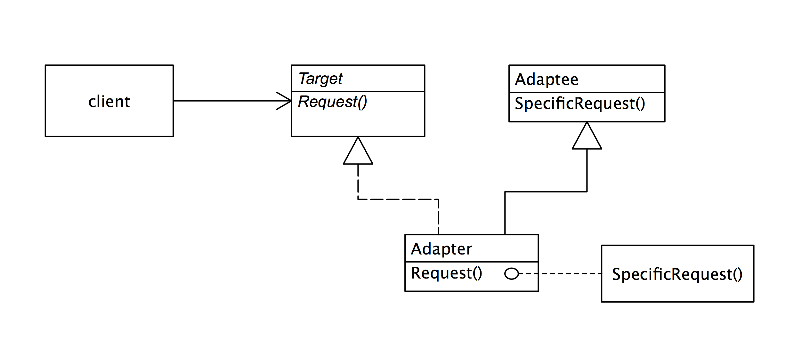
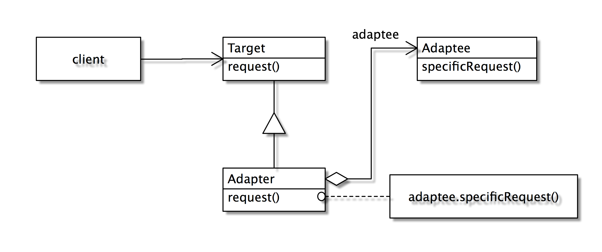

# Adaptor

> 乾坤挪移

### Intent 目的

轉換類別的介面成另一個介面所預期的樣式。Adapter 能夠讓不相容的介面，用轉接的方式合作，並且相容。

### Motivation 動機

各位都有要將三孔插頭插入二孔插座時的困擾吧！怎麼辦呢？除了將多餘的一角拔掉外，我們可以買一個三轉二的轉接器來做調整。在軟體的設計上，我們也常遇到過同樣的問題：

物件A在某個環境下使用介面 I1 來達成某個功能，但換到另一個環境時，提供相同功能的物件B的介面卻不是 I1，而是另一個不同的 I2。在不修改A物件的呼叫與 B 物件的介面時(正如同我們不願修改插頭與插座)，我們如何能讓物件 A 正確的呼叫到該功能？

有時候我們在引用一些類別介面時，有些功能無法引用，是因為介面不相容，我們可能有原始碼但卻不想更動到它的原始結構，或是我們並不知道它的原始碼，只知道它的操作方式。這時候使用轉接器(Adapter)設計樣式，做一個轉接的代理接口，就能讓兩個原本不相容的介面接合在一起。


### Structure 結構

Adapter所以分為2種，一為類別轉接器(class Adapter)，一為物件轉接器(object Adapter)。前者使用繼承(inheritance)的技巧，而後者使用委託(delegation)的技巧。






### Applicability 應用時機

當你想使用手邊已存在的類別時，但它的介面並不相容於你所預期的樣式，或是你想發展一個可以Reuse的類別，讓它能夠和不相容介面相互合作。

### Consequence 效益
- 類別轉接器（class adaptor）：如果Adaptee(預期轉換端)是一個非Java介面的類別，那我們便無法轉接一個類別和它子類別，那Adapter類別是一個Adaptee的子類別。
-  物件轉接器(Object adaptor)
：讓單一Adapter能夠和Adaptee自身和其子類別一起工作。


### SquarePeg
```java
public class PegAdapter extends SquarePeg {
  private RoundPeg roundPeg;
  public PegAdapter(RoundPeg peg)  {
     this.roundPeg = peg;
  }
  public void insert(String str)  {
     roundPeg.insertIntoHole(str);
  }
}

public class TestPegs {
  public static void main(String args[])  {

    RoundPeg roundPeg = new RoundPeg();
    SquarePeg squarePeg = new SquarePeg();
    squarePeg.insert("Inserting square peg...");
    
    PegAdapter adapter = new PegAdapter(roundPeg);
    adapter.insert("Inserting round peg...");
  }
}
```

Client program output:

> SquarePeg insert(): Inserting square peg...
> 
> RoundPeg insertIntoHole(): Inserting round peg...


### Copy Example 

考慮一個 VectorUtility 類別，其提供了一個copy的功能，可以將某個Vector複製到另一個Vector，但前提是Vector內的元素必須符合isCopyable的介面：
    
```java
    class VectorUtility {
        public static Vector copy(Vector vin) {
        Vector vout = new Vector( );
        Enumeration e = new vin.elements( );
        while (e.hasMoreElements( )) {
            Copyable c = (Copyable)e.nextElement( );
            if (c.iscopyable)
                vout.addElement(c);
            }
       }
    }
```    

例如Book符合Copyable的介面，則VectorUtility就可以複製一個以Book建立的Vector：
    
```java
    Vector v = new Vector( );
    v.add(new Book("b1");
    v.add(new Book("b2");
    VectorUtility vu = new VectorUtility( );
    Vector v2 = vu.copy(v);
```
    
若我們要複製的東西是student，但student並不支援Copyable介面，但提供一個相似的功能介面—isValid( )。如何能讓VectorUtility也可以來copy student的Vector呢？

看看Adapter如何幫忙吧！
    
```java
    public class StudentAdapter implements Copyable {
       private Student s;
       public StudentAdapter(Student s) {
           this.s = s;
       }
      public boolean isCopyable( ) {
           return s.isValid( );
      }
    }
```

其UML的結構如下：


而使用VectorUtility來copy的方式如下：
    
```java
    Vector v = new Vector( );
    v.add(new StudentAdapter(new Student("s1")));
    v.add(new StudentAdapter(new Student("s2")));
    VectorUtility vu = new VectorUtility( );
    Vector v2 = vu.copy(v);
```
    
請注意Vector內加的物件是一個StudentAdapter，如此才可以給VectorUtility判斷是否可copy。各位會不會有個疑問：Vector內放一群StudentAdapter作什麼？我的目的應該是放一群Student呀？可別忘了StudentAdapter內有一個private物件Student，我們只要宣告一個介面讓外界取得到就好了。因此，將StudentAdapter修改如下：
    
```java
    class StudentAdapter {
       private Student s;
       public StudentAdapter(Student s) {
          this.s = s;
       }
       public boolean isCopyable( ) {
          return s.isValid( );
       }
       public Student getStudent( ) {
          return s;
       }
    } 
```

### Window Adaptor

Window adaptor 是另一種特殊的 adaptor.

熟悉Java GUI設計的人一定常利用WindowAdapter來做closing的動作：

```java  
public static void main(String arg[]) {
  Test application = new Test( );
  application.addwindowlistener(
    new WindowAdapter( ){
    public void WindowClosing (WindowEvent event){
      System.exit(0);
    }
  });
}
```

new WindowAdapter( )將會產生一個匿名類別，其為WindowAdapter的子類別，並修改(Override)WindowAdapter的方法windowClosing。addWindowListener的參數應該是一個WindowListener的物件，為何會是一個WindowAdapter呢？

其實 WinAdapter實作 WindowListener：

```java
class WIndowAdaptor implements WindowListener{
   public void windowActivated(){}
   public void windowClosed(){}
   public void windowClosing(){}
}
```

其實WindowAdapter內所有的operation都是空的。為什麼要做一個空的類別？因為如此一來WindowAdapter的子類別只需要override其想修改的operation即可。倘若上例不用Adapter來做，則程式必須如此麻煩：
  
```java
application.addWindowListener(
     new WindowListener( ) {
         public void windowActivated(){}
         public void windowClosed(){}
         public void windowClosing(){
             System.exit(0);
         }    
     }
);
```
  
各位注意到了嗎？即使 application 只想處理windowClosing而已，但因為它實作 WindowListener 就必須把所有的 event “照抄”一次(內容都是空的)。所以，在此例中，WindowAdapter 做為 application 物件與 WindowListener 的轉接器。

### 習題：

1. Java 過去的集合型態（collection）都實踐 Enumeration 的介面，但新版的則開始使用 Iterator  的介面，我們需要一個 Iterator 轉 Enumeration 的 Adaptor，請設計之。
2. 說明 物件轉接器 和類別轉切器的差別
3. 說明 Target, Adaptor, Adaptee 的關係

