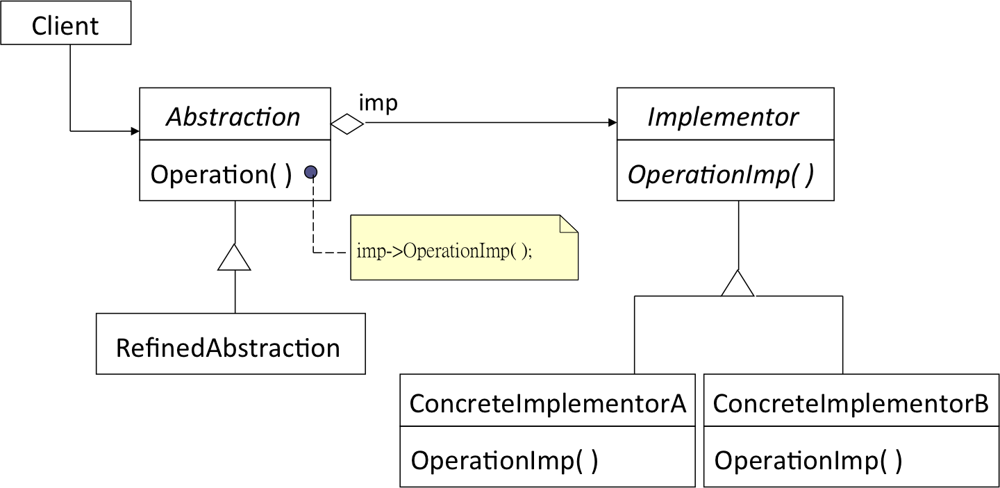

# Bridge

> 子類別的含意到底是什麼？為父類別實踐一個實作？還是表達一種特殊的抽象？
> 
> 如果當兩者都要時，該怎麼辦？

### Intent
Decouple an `abstraction` from its `implementation` so that the two can vary independently.

把`抽象`和`實作`抽離開來，使得兩者可以獨立的變化

### Motivation
When an abstraction can have one of several possible implementations, the usual way to accommodate them is to use inheritance. But this approach is not always flexible enough.

當一個抽象有多個實作時方法時，通常我們會使用繼承來設計：每一個子類別表示一個不同的實作。但有時候這樣的方法沒有彈性。因為該抽象本身也可以分解成其他的類別，形成另外一個繼承結構。

#### Window example
例如，一個視窗可以有兩種不同的實作：*XWindow* 或是 *PMWindow*。當我們要把 *Window* 分成 *IconWindow* 和 *TransientWindow* 兩種不同的類別，那麼我們就需要設計 `2*2` 個類別。同理，如果當實作方面又多一個 MacWindow, 抽象方面又多一個 SquareWindow, 那我們就需要 `3*3` 個類別。類別會越來越多，有沒有可能簡化設計？

```
Window
- IconWindow
   - IconXWindow
   - IconPMWindow
- TransientWindow
   - TransientXWindow
   - TransientPMWindow
```

答案就是 Bridge 設計樣式。

### Applicability

- You want to avoid a permanent binding between an abstraction and its implementation. 當我們想避免抽象和實作永遠的綁在一起時。
- Both the abstractions and their implementations should be extensible by subclassing. 當抽象和實作都可能透過繼承來擴充時。
- Changes in the implementation of an abstraction should have no impact on clients. 當更改實作時不會對該抽象有影響時。（例如 PMwindow 的實作方法改變了，但這不應該會引想到 IconWindow 的特性)

### Structure



### Example

```java
abstract class Shape {
	public abstract void draw();
	
	ShapeImp imp;
	public Shape(ShapeImp imp) {
		this.imp = imp;
	}
	protected void drawLine(int x1, int y1, int x2, int y2) {
		imp.drawLine(x1, y1, x2, y2);
	}
}

class Rectangle extends Shape {
	int x, y, w, t;
	
	public Rectagle(int a, int b, int w, int t, ShapeImp imp) {
		super(imp);
		x=a; y=b; this.w=w; this.t=t;		
	}

	@override
	//Rectagle 知道如何利用 drawLine 畫出方形。但他並沒有綁真正的實作。
	public void draw() {
		drawLine(x, y, x+w, y);
		drawLine(x+w, y, x+w, y+t);
		drawLine(x+w, y+t, x, y+t);
		drawLine(x, y+t, x, y);
	}
}

class Square extends Shape {
	... 
}

interface ShapeImp {
	public void drawLine(x1, y1, x2, y2);
}

class Draw2D implements ShapeImp {
	public void drawLine(x1, y1, x2, y2) {
	   // real implementation of draw2d
	}
}

class Draw3D implements ShapeImp
	public void drawLine(x1, y1, x2, y2) {
	   // real implementation of draw3d
	}	
}

class Demo {
	public static void main(String args[]) {
		Shape r1 = new Rectage(1,1,2,3, new Draw2D());
		r1.draw();

		Shape r2 = new Rectage(1,1,2,3, new Draw3D());
		r2.draw();

		Shape s1 = new Square(1,1, 4, new Draw3D());
		s1.draw();
	}
}

```
