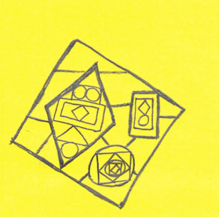
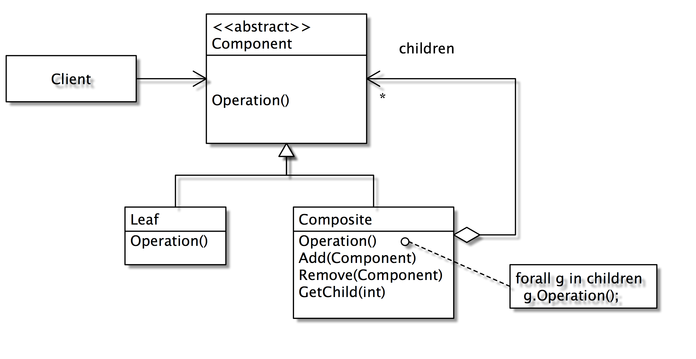

# Composite



> 容器，可以裝東西
> 
> 也可以被裝。

#### Intent

Compose objects into **tree** structures to represent part-whole hierarchies. Composite lets clients treat individual objects and compositions of objects **uniformly**. 

複合設計樣式的目的是要單元物件與複合物件**一視同仁**, 以降低程式的複雜度。所謂的複合物件就是它可以包含其他的複合物件或單元物件。

This is called **recursive composition **

下面的樹狀結構就是一個典型的複合物件

```
composite1
- leaf1
- leaf2
- composite2
	- composite2.1
		- leaf3
		- leaf4
	- leaf5
- leaf6

composite2
- leaf2
- leaf9

```


#### Applicability
- You want to represent part-whole hierarchies of objects 物件間有複合的關係
- You want clients to be able to ignore the difference between compositions of objects and individual objects. Clients will treat all objects in the composite structure uniformly. 我們不想區別單元物件與複合物件之間的差異，對他們有相同的呼叫方式

#### Structure



#### Benefits 
- It makes it easy to add new kinds of components 容易新增新的元件
- It makes clients simpler, since they do not have to know if they are dealing with a leaf or a composite component 讓客戶端的物件設計更為容易，因為不用區分單元物件與複合物件的差異

### GUI 元件範例

#### Solution 1

```java
public class Window {
   Button[] buttons;
   Menu[] menus;
   TextArea[] textAreas; 
   WidgetContainer[] containers;

   public void update() { 
      if (buttons != null) {
         for (int k = 0; k < buttons.length; k++) {
            buttons[k].draw();
    	      if (menus != null) {
                for (int k = 0; k < menus.length; k++)
            	    menus[k].refresh(); 
            if (containers != null)    
    	        for (int k = 0; k < containers.length; k++ )    
        	    containers[k].updateWidgets();
	       }
      }
   }
}
```

在這個例子中我們看到視窗物件把各種不同的介面元件視為不相同的物件，每一個呼叫的方式都不一樣。如此一來，這個程式的複雜度變高了，整個程式的耦合力也相對的高。

#### Solution 2

Problem of first solution
- It violates the Open-Closed Principle. 
- If we want to add a new kind of widget, we have to modify the update() method of Window to handle it. 

**問題：**違反開閉原則，當我們要新增新的元件、我們必須修改原來的程式碼


為了解決這個問題，程式碼修改如下：

```java
public class Window {
   Widget[] widgets; 
   WidgetContainer[] containers; 
   
   public void update() {	   
      if (widgets != null)
         for (int k = 0; k < widgets.length; k++) {
             widgets[k].update(); 
             if (containers != null)	
                 for (int k = 0; k < containers.length; k++ ) 
                     containers[k].updateWidgets()
       	 }
      }
   }
}   
```

在第二個解決方案中，我們把所有單元物件的介面統一，如此一來，程式變的更簡單了。但是單元物件與複合物件仍是不同的介面，處理上還是需要分開來。我們可以用 Composite 來改善。

#### Solution 3: The Composite Pattern!

```java
public class Window { 
   Component[] components; 
      public void update() {
         if (components != null) 
            for (int k = 0; k < components.length; k++) 
               components[k].update(); 
    }       
} 
```

在第三個方案中，所有的物件都視為 Component 了，統一的介面方法都是 update(), 程式是不是變得更簡潔了？

### Transparent vs. Safe 

**Transparent**： Component 具備 operation 以外，還具備了 add(Component), remove(Component) 等複合物件的方法。如此一來，Component 和 Composite 是沒有差異的，所以稱為 Transparent。但如此一來，Leaf 物件繼承了 add() 的功能顯得奇怪，通常我們會讓它沒有作用：

```java
   class Leaf extends Component {
      @Override
      public void operation() {}
   }
```
	
這是相當危險的，因為 Client 可能誤以為你有加入 Component 物件。	 

**Safe**：Component 僅具備 operation 方法。Client 要新增元件時，必須先判斷它是不是一個複合物件：

	if (component instanceOf Composite) {
		(Composite).add(...)
		

### 實作

實作方面，我們通常會把一個 collection 物件（如 arraylist) 埋在 composite 物件中，讓他來執行單元物件的管理。

```java
class Graphic implements Component {
   ArrayList<Component> gList;
		
   public void add(Component c) {
      gListc.add(c);
   }
		
   public void update() {
      for (all gList in glist) {
         g.update();
      }
   }
}
```
	
在 Java 中，複合物件的相關管理功能都會委託給 ArrayList 等 Collection 物件來幫忙管理。
