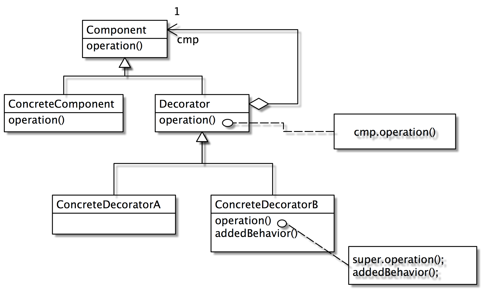
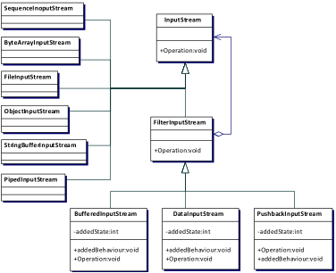

# Decorator


> 聖誕樹，裝了鈴鐺還是聖誕樹；再裝了bling bling 的星星還是聖誕樹；
> 
> 再裝上禮物還是聖誕樹

### Intent
Attach additional responsibilities to an object dynamically. Decorators provide a flexible alternative to subclassing for extending functionality.

可以動態的為一個物件加上功能（責任）。Decorator 提供一種有彈性的方法來過繼承來擴充方法。

### Motivation
當透過繼承來新增物件的功能不實際，或會產生過多的物件時，可以使用 Decorator 來動態的新增物件功能。

### Structure


如果我們有 Decorator 類別 D1, D2, D3, D4, 其功能分別為 f1, f2, f3, f4。ConcreteComponent 的類別假設為 CC(), 其方法為 m()。

```java
 Component d = new D2(new D1(new D3(new D4(new CC()))))
```

則執行的 `d.m()` 的順序會是 `f2()=> f1()=>f3()=>f4()=>m()`

### TextView 範例

以下為使用 Strategy 設計樣式

```java
public class TextView { 
    private Border border; 
    private Scrollbar sb; 
    public TextView(Border border, Scrollbar sb) { 
        this.border = border; this.sb = sb; 
    } 
    public void draw() { 
        border.draw(); 
        sb.draw(); 
        drawTextView()// Code to draw the TextView object itself. 
} } 
```

以下為使用 Decorator 設計樣式

```java
public class FancyBorder { 
     private Component component; 
     public FancyBorder(Component component) { 
          this.component = component; 
     } 
     public void draw() { 
          drawFacy() // Code to draw the FancyBorder object itself. 
          component.draw; 
     } 
} 

public class Client { 
    public static void main(String[] args) { 
        TextView data = new TextView(); 
        Component borderData = new FancyBorder(data); 
        Component scrolledData = new VertScrollbar(data); 
        Component borderAndScrolledData = 
            new HorzScrollbar(borderData); 
    } 
} 
```

> Strategy 換骨，Decorator 換皮

### Java I/O 範例

熟悉JAVA I/O 的讀者對 Decorator 應該有似曾相識的感覺吧！我們先看 Input Stream 的類別圖：



在JavaI/O中InputStream和OutPutStream都有BufferredStream、DataStream、PushbackStream的功能需求，但是如果靜態的生成方式必須作出 `2*2*2=8` 種不同搭配的類型，這樣讓系統架構變得很複雜龐大，修改維護上更是麻煩。


因此JavaI/O的結構使用裝飾品(Decorator)樣式去解決這樣的問題，FilterInputStream的角色就相當於圖14.3中的Decorator，而BufferredInputStream，DataInputStream，PushbackStream等為InputStream類別的裝飾品：

- BufferredInputStream：支援buffering的功能
- DataInputStream：I/O支援JAVA基本型態
- PushbackInputStream：支援undo的功能

下列說明InputStream的用法：

```java
    //建立一個基本的檔案輸入通道
    FileInputStream fin = new FileInputStream ("decorator.txt") ;
    //建立一個支援buffering的檔案輸入通道 – 擴充fin
    BufferredInputStream bfin = new BufferredStream (fin) ;
    //建立一個支援buffering及undo的檔案輸入通道 – 擴充bfin
    PushbackInputStream pbfin = new PushBackInputStream (bfin);
```

如果一開始就想建立一個支援 buffering 及 undo 的檔案輸入通道，可以簡化的寫：

```java
    PashBackInputStream in = new PushBackInputStream (new Bufferred InputStream (new FileInputStream ("decorator.txt"))) ;
```

注意：當骨幹建立以後，各點綴品的建立並沒有先作之別。也就是說，你可以先建立 pushback 的功能再建立 bufferring 的功能。因此上式可以改寫成：

```java
    in = new BufferedInputStream (new PushBackInputStream (new FileInputStream ("decorator.txt"))) ;
```


