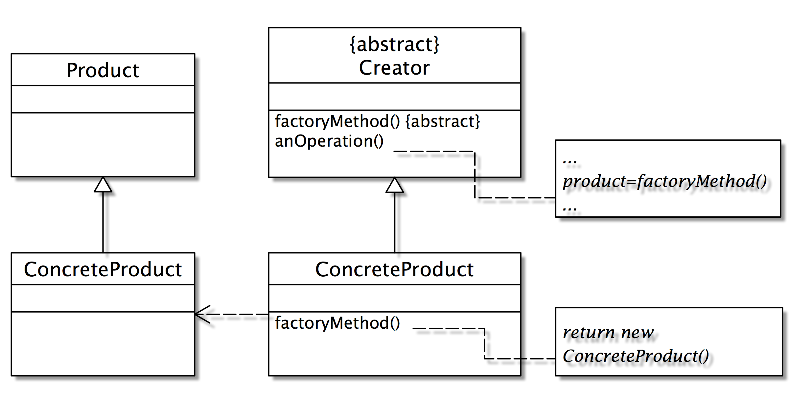

# Factory Method

> 小器晚成

物件會被延遲生成，故曰晚成; 這個物件相對於建造者物件是小的，故曰小器晚成。

### 目的(Intent)

定義一介面以生成物件，但將其生成延遲給子類別來作決定。

### 動機

假設某一個Application物件可以產生Document物件以供其使用完成Application物件的工作。如果直接在Application某方法內生成文件物件，如下

    class Application {
       void operation1() {
           doc = new Document();
       }
    }

則日後Application物件想建立不同型態的文件物件(例如HTML文件、Word文件)時，則必須修改operation1()方法如下：

    doc = new HTMLDocument();    
or

    doc = new WordDocument();

這樣的缺點是如果我們每一次有新的文件類別產生時就必須修改程式(operation1())一次。我們可以將生成文件的動作抽象為一個方法，當日後有新的文件物件產出時，只要擴充Application類別即可，不需要修改文件物件。使用工廠方法的動機即為解決此類問題。下圖為採用此設計樣式後的結構。
 
### 結構

 
### 參與者
- Creator (建立者)
     - 宣告Factory Method，回應一個物件型態的Product。
- ConcreteCreator (實際建立者)
     - 修改Factory Method，回應一個新的ConcreteProduct。與Product的關係為：Creator會建立Product物件。
- Product (產品或零件)
     - 定義物件的Factory Method型態介面。
- ConcreteProduct (實際產品)
     - 實作的Product介面。
 
### 應用時機(Applicability)：
- 建立者(Creator)無法預期將產生何種物件，並希望其子類別來決定生產何種物件時。

### 優缺點：
- 避免生產特別用途(application-specific)的物件與增加程式的彈性。
- 生產者只為了生產另一個特別的產品時，就必須建立一個子類別。

### 迷宮範例

接下來以Gamma 書中的實例說明Factory Method的用處。考慮一個迷宮的程式。一個迷宮包含許多房間、牆、門等物件，所以當MazeGame在建立時，必須建立一些『零件』物件，如Room、Door、Wall等：

#### 未使用設計樣式的設計：

    public class MazeGame {
        // 建立一個迷宮
       public Maze createMaze() {
          //產生建立迷宮遊戲的所需零件物件，包括Maze、Door、Room等
          Maze maze = new Maze();
          Room r1 = new Room(1);
          Room r2 = new Room(2);
          Door door = new Door(r1， r2);
          //建立各子物件之間的關聯
          maze.addRoom(r1);
          maze.addRoom(r2);r1.setSide(MazeGame.North， new Wall());
          r1.setSide(MazeGame.East, door);
          r1.setSide(MazeGame.South, new Wall());
          r1.setSide(MazeGame.West, new Wall());
          r2.setSide(MazeGame.North, new Wall());
          r2.setSide(MazeGame.East, new Wall());
          r2.setSide(MazeGame.South, new Wall());
          r2.setSide(MazeGame.West, door);
          return maze;
        }
     }
 
程式中的第5~8行建立Room、Door等零件物件，第10~18行則建立這些物件的關係。圖9.3描述此實例的架構。

如果現在我們想擴充迷宮的功能，例如擴充迷宮內的房間是具備魔法的房間（enchanted room），我們可以建立一個一個新的類別EnchantedRoom， 令其繼承Room，如下：

     class EnchantedRoom extends Room {
        …
     }    

而MazeGame(見程式1)中的createMaze方法也作修改，使其建立的房間是EnchantedRoom，不是Room：

     Room r1 = new EnchantedRoom(1);
     Room r2 = new EnchantedRoom(2);

這樣的程式在執行上並不會有問題，只是它『違背了OCP的原則』-- 我們為了新增的功能而修改了原存在的類別內容。
我們可以使用工廠方法來解決這個問題，將『生產Room的工作』抽象為一個方法：

#### 使用設計樣式

     public class MazeGame {
       public Maze makeMaze() {    
            //將生產Maze物件的工作抽象成一個方法
            return new Maze();
       }
       public Room makeRoom(int n) {
          //將生產Room物件的工作抽象成一個方法
          return new Room(n);
       }
       public Wall makeWall() {
          return new Wall();
       }
       public Door makeDoor(Room r1， Room r2)  { 
          //將生產Door物件的工作抽象成一個方法
          return new Door(r1, r2);
       }
       public Maze createMaze() {
          Maze maze = makeMaze();
          Room r1 = makeRoom(1);
          Room r2 = makeRoom(2);
          Door door = makeDoor(r1, r2);
          maze.addRoom(r1);
          maze.addRoom(r2);
          …
          return maze;
       }
    }

請注意第6~16行的目的是在建立Room、Door等物件，與上一個程式的第5~8行的目的是一樣的，可是我們卻將生產Door，Room等工作包成一個方法(makeDoor()、makeRoom()等)，其目的在提供一個子類別覆蓋的機會。請看新版的MazeGame--EnchantedMazeGame：

     public class EnchantedMazeGame extends MazeGame {
        public Room makeRoom(int n) {
           return new EnchantedRoom(n);
        }
        public Wall makeWall() {
           return new EnchantedWall();
        }
        public Door makeDoor(Room r1, Room r2)  {
           return new EnchantedDoor(r1, r2);
        }
     }

請將程式3中第03行與程式2中的第8行相比較，前者回傳一個Room物件，而後者回傳一個EnchantedRoom物件；相同的是makeRoom在這兩個程式中的介面都沒有變。所以，EnchantedMazeGame擴充MazeGame後所做的事很單純，就是讓所有生產物件的方法生產新的物件，例如第3行回傳新版的Room -- EnchantedRoom。我們再做兩個觀察：

- OCP的原則吻合了嗎？是的，我們的功能加強了，但沒有任何程式碼做了修改。我們沒有新增EnchantedMazeGame與EnchantedRoom兩個類別。
- makeRoom()的介面有相容嗎？是的，雖然MazeGame.makeRoom()的傳回型態是定義為Room，而EnchantedMazeGame.makeRoom()是傳回EnchantedRoom物件，但因為EnchantedRoom繼承自Room，因而型態上是相容的。

相對應的UML圖如下：
 
如上的UML圖：新增類別以擴充功能：EnchantedMazeGame與EnchantedRoom

#### 心得

我們獲得的心得是：在設計此某物件(MazeGame)時，如果知道它一定會建立某些零件物件(Room)時，為了想保留零件物件的彈性(亦即可以建立零件物件的子類別物件)，我們可以將建立零件物件的功能特別獨立出來成為一個方法(makeRoom())，這個方法就稱為 Factory Method(makeRoom())。

了解Factory Method後，Abstract Factory各位就更容易瞭解了。相較於Factory Method將生產包裝成一個方法，Abstract Factory將生產包裝成一個類別。我們將在下一章節介紹Abstract Factory。 
