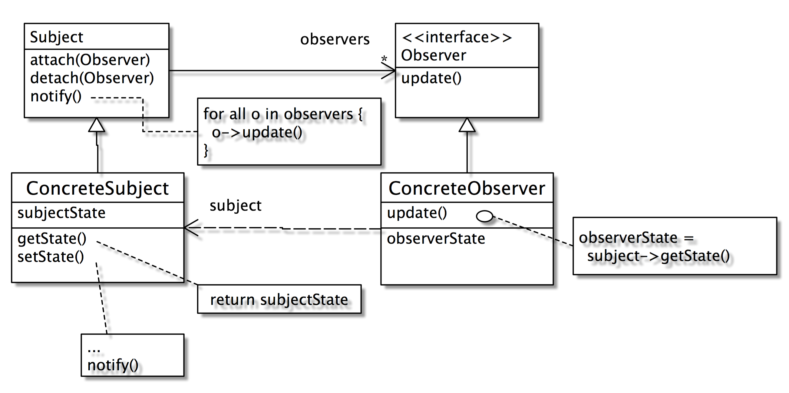

# Observer


*Define a one-to-many dependency between objects so that when one changes state, all its dependents are notified and updated automatically*

### Intent

定義一個『一對多』的相依關係，使得當『一』的物件狀態改變時，所有相依於『一』的『多』物件會被通知到並作適當的修改。

### 動機

考慮一個股票資料有三種呈現方式，股價及成交量修改後，其相關的呈現方式也要跟著改變

1. 當股價變動時，跟著呼叫介面物件做修改。股價的資料屬於資料物件（model），介面物件屬於 view。資料物件直接呼叫介面物件是一種不好的設計，因為介面物件的變動性大，資料物件會因為介面物件的改變而需要做改變。
2. 介面物件每隔一段時間去讀取資料物件。問題是：我們無法知道多久該去讀取一次。

方法一示意程式：

	class Stock {
	   price ...;
	   public priceChange(int newPrice) {
	      this.price = newPrice;
	      view1.refesh();
	      view2.update();
	      view3.reload();
	   }
	}


如何用一個架構輕易達到這個目的呢？答案是Observer設計模式。在Observer中，像股價等資料通常被稱主體(Subject)或被觀察者（Observable），而呈現方式則稱為觀察者(Observer)。 

### Structure


### 參與者

- Observable：定義一個有多個觀察者的資料的基本資料型態與介面。其中的addObserver()表示加入一個新的observer，而notifyObserver()表示要通知所有與其相關的觀察者。
- ConcreteObservable：實際的被觀察者。
- Observer：定義一個觀察者的基本結構與介面，其中的update()給觀察者收到被觀察者資料異動訊息時的處理程序。
- ConcreteObserver：實際的觀察者。

### 應用時機
- 當後端資料有所變更，有必須即時的更新前端資料呈現之需求。
- 當一個事務有兩個角度，其中一個角度相依於另一個
- Encapsulating these aspects in separate objects lets you vary and reuse them independently
- When a change to one object requires changing others
- When an object should be able to notify other objects without making assumptions about those objects
### 優缺點
分離了資料模組與呈現模組使得溝通能夠更容易廣泛的被應用，當資料變更不需觀察者做出更新動作才能更新，保持資料呈現的一致性。

### Observable 的應用

Java 已經針對這個設計樣式沒計了一個API, 其中 Observable 相對於 Subject, Observer 則名稱不變。

    public class ConcreteSubject extends Observable {
       private String name;
       private float price;
      
       public ConcreteSubject(String name, float price) {
          this.name = name;
          this.price = price;
          System.out.println("ConcreteSubject created: " + name + " at ” + price);
       }

       public String getName() {return name;}
       public float getPrice() {return price;}

       public void setName(String name) {
          this.name = name;
          setChanged();
          notifyObservers(name);
       }

       public void setPrice(float price) {
          this.price = price;
          setChanged();
          notifyObservers(new Float(price));
       }
    } 
   
接著來看看 Observer 這一端：

    // An observer of name changes.
    public class NameObserver implements Observer {
        private String name;
        public NameObserver() {
            name = null;
            System.out.println("NameObserver created: Name is " + name);
          }

        public void update(Observable obj, Object arg) {
           if (arg instanceof String) {
             name = (String)arg;
             System.out.println("NameObserver: Name changed to " + name);
           }
        }
     }
     
PriceObserver 則是另一個觀察者，當價格有變動時，它就會有所反應。

    // An observer of price changes.
    public class PriceObserver implements Observer {
       private float price;
       public PriceObserver() {
          price = 0;
          System.out.println("PriceObserver created: Price is " + price);
       }

       public void update(Observable obj, Object arg) {
          if (arg instanceof Float) {
             price = ((Float)arg).floatValue();
             System.out.println("PriceObserver: Price changed to " + price);
          }
       }
    } 

來看看主程式

    public class TestObservers {
       public static void main(String args[]) {
          // Create the Subject and Observers.
          ConcreteSubject s = new ConcreteSubject("Corn Pops", 1.29f);
          NameObserver nameObs = new NameObserver();
          PriceObserver priceObs = new PriceObserver();

          // Add those Observers!
          s.addObserver(nameObs);
          s.addObserver(priceObs);

          //make changes to the Subject.
          s.setName("Frosted Flakes");
          s.setPrice(4.57f);
          s.setPrice(9.22f);
          s.setName("Surge Crispies");
       }
    } 
    
注意到 s.addObserver(nameObs) 的作用是把觀察者和被觀察者 bind 的方法。

### 委託的應用

如果 ConcreteSubject 已經有繼承了另一個類別了，無法繼承 Observable 那該怎麼辦？我們可以用委託的方式把 observable 委給 delegatedObservable。

    public class SpecialSubject extends ParentClass {
       private String name; private float price;
       private DelegatedObservable obs;

       public SpecialSubject(String name, float price) {
          this.name = name;
          this.price = price;
          obs = new DelegatedObservable();
       }

       public String getName() {return name;}
       public float getPrice() {return price;}
       public Observable getObservable() {return obs;}

       public void setName(String name) {
          this.name = name; obs.setChanged();
          obs.notifyObservers(name);
       }
 
       public void setPrice(float price) {
          this.price = price;
          obs.setChanged();
          obs.notifyObservers(new Float(price));
       }
    }

    // A subclass of Observable that allows delegation.
    public class DelegatedObservable extends Observable {
         public void clearChanged() {
            super.clearChanged();
         }

         public void setChanged() {
            super.setChanged();
         }
    }

大家會不會覺得奇怪，為什麼不直接委給 Observable，而是在宣告一個 DelegatedObservable, 然後委給 DelegatedObservable？原來 Observable.setChanged() 被設定為 protected，如果沒有透過繼承是無法呼叫的，因此我們將之繼承後再開放為 public。

    public class TestSpecial {
       public static void main(String args[]) {
           // Create the Subject and Observers.
           SpecialSubject s = new SpecialSubject("Corn Pops", 1.29f);
           NameObserver nameObs = new NameObserver();
           PriceObserver priceObs = new PriceObserver();

           // Add those Observers!
           s.getObservable().addObserver(nameObs);
           s.getObservable().addObserver(priceObs);
              
           // Make changes to the Subject.
           s.setName("Frosted Flakes");
           s.setPrice(4.57f);
           s.setPrice(9.22f);
           s.setName("Surge Crispies");
       }
    }

#### 私有漏洞（Privacy leak）

各位可以看到第 9-10 行的 s.getObservable().addObserver(nameObs)，先透過 getObservable() 獲得 Observable 物件，再透過它來作 addObserver 的動作。這樣的缺點是外界的物件很容易取得 Observable 的參考，就有可能拿著這個參考胡作非為（例如 deleteObserver())。為了避免這種狀況，我們新增 addObserver() 這個方法，在裡面進行委託；並且移除 getObservable() 的方法，避免私有漏洞的可能。

    public class SpecialSubject2 extends ParentClass {
       ...   
       public void addObserver(Observer o) {
           obs.addObserver(o);
       }
       ...
    }

### ActionListener

JAVA 的event model 與 Observer的架構類似。

- AbstractButton => Observable
	- fireActionListener() => notifyObserver()
- ActionListener => Observer
	- actionPerformed() => update()

其中的AbstractButton就相當於Observer中的Observable，而向它註冊的就是那些監聽事件發生的類別，也就是實作ActionListener的物件(Event Handler)。由於JButton本身已是AbstractButton的子類別，我們只要直接在JButton的實作中加入事件監聽者即可：
  
     public class TestEventModel extends JFrame{
         private JButton b1;
         public TestEventModel() {
            b1 =  new JButton("Button");
            getContentPane().add(b1);

            //相當於 addObserver()
            b1.addActionListener(new Listener1());
            b1.addActionListener(new Listener2());            
            ...
         }   
     }

     //ActionListener 相當於 Observer, actionPerformed 相當於 update()
     class Listener1 implements ActionListener {
         public void actionPerformed(ActionEvent e) {
             System.out.println("Event happen");
         }
     }

     class Listener2 implements ActionListener {
         public void actionPerformed(ActionEvent e) {
             System.out.println("Hello world");
         }
     }

AbstractButton 內的 fireActionPerformed()相當於 Observable 內的notifyObservers()，但我們不需要去呼叫它，因為當我們按下Button時會直接呼叫 fireActionPerformed()，進而呼叫所有的 ActionListener 內的actionPerformed()。

有時候程式不是很複雜時，事件的發生與處理在同一個類別內，所以常可以看到這樣的程式碼：
    

     class TestEventModel2 extends JFrame implement ActionListener {
        ...
        b1.addActionListener(this);
        public void actionPerformed(ActionEvent e){
           ...
        }
     }


此時的TestEventModel2同時兼具了event source與event listener的功能，亦即觀察者與被觀察者的雙重身分。 

#### 一個沒有用樣式的程式

（counter 的例子）


Observer 自我測驗
===

基礎
---

(1) Observer 設計樣式主要有兩個物件：Subject 與 Observer: 

1. 一個 subject，多個 observer
2. 一個 observer 一個 subject  
3. 一對一的關係 
4. 多對多的關係

(2) 關於 Observer 樣式，何者為真：

1. Subject 變動時，Observer 會被通知 
2. Observer 變動時，Subject 被通知 
3. Observer 定時查詢 Subject 狀態 
4. Subject 定期查詢 Observer 狀態

(3) java API  中實踐 Subject 的類別為

1. Object
2. Subject
3. Observable
4. Observer

(4) 請寫出 java.util.Observer 此介面 注意參數的正確。

```
interface Observer {
   
   
}

```


(5) 請畫出 Observer 的架構

```


```

(6) 應用 Observer 樣式時，擔任 Subject 的類別，當狀態改變時，要呼叫哪一個方法？
```


```

(7) 以下 View1 是一個 Observer, ?1 和 ?2 為何
```
class View1 implements Observer {
	public void update(?1 obs, ?2 obj) {
		...
	}
}
```
(8) Stock 是一個 Subject, 價格改變時會通知所有的 observer, 以下 ? 為何
```
class Stock extends Observable {
	public void increasePrice() { //will 
		price++;
		setChanged();
		?
	}
}
```

進階
---

(1) 為何 Subject 可以通知所有不同的物件，又可以避免過高的耦合力？

```


```

(2) 當 Subject 物件已經有必要的父類別時，無法在繼承 java.util.Observable, 該如何實踐 Observer 樣式？
```


```

(3) 在透過委託來實踐 Observer 的方法中，為何 Subject 不直接委託給 Observable 物件，而是委託給 DelegatedObservable？
```


```

(4) 同上，Subject 包含 DelegatedObserver 是屬於

1. aggregation (弱包含，邏輯上的包含）
2. containment （強包含，被包含者的生命週期由包含者決定）

(5) 同上，為什麼？
```


```

(6) Java 的 Swing 架構使用 Observer，其中 ActionListener 相當於 Observer 樣式中的？

1. Subject
2. Observer
3. Concrete Observer
4. Concrete Subject

(7) 同上，像 JButton 這一類的元件，相當於 Observer 樣式的？

1. Subject
2. Observer
3. Concrete Observer
4. Concrete Subject

(8) 如果我們不透過 java API 來實踐 Observer, 想要自己在 Stock 類別中實踐 Observable 的功能，該怎麼設計 addObserver(), notifyObserver() 等方法？資料結構該怎麼設計？

```
class Stock {
	Vector observers;

	public Stock() {
		observers = new Vector();
	}

	addObserver(?) {
		?
	}

	notifyObserver(?) {
		?
	}
}	
```

程式
---

(1) 應用Observer 設計樣式，寫一個股票觀看的模擬系統

* 透過亂數隨機的變動股價
* 股價一變動所有的介面呈現都會跟著變動
* 可能的介面：股價波動圖，股價變動差異圖，股價現價圖