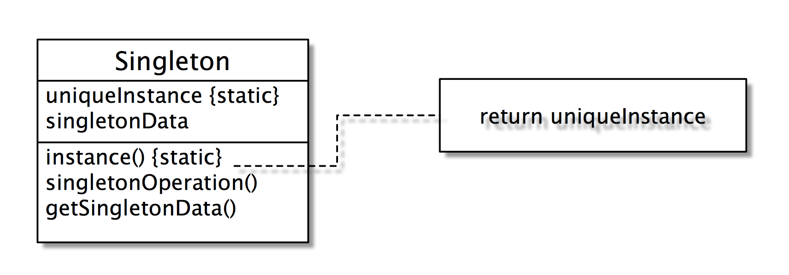

# Singleton


> 獨一無二

### Intent 目的

Ensure a class only has one instance, and provide a global point of access to it. 

確定一個類別只會有一個物件實體，並且提供一個可以存取該物件的統一方法。

### Motivation 動機
有時候我們在系統中只想要一個實體，唯一的一個。例如說我們只需要一個視窗管理員，只需要一個 RadioPlayer(要不然聲音就打架了)，只需要一個產品的工廠物件（請參考 Abstract factory）。我們希望該唯一的物件很容易的被讀取到；並且確定不會有其他的物件被產生出來。

### Structure 結構



### Benefits 優點

控制外界的物件只能參考到同一唯一的一個物件。

### Singleton without subclassing 沒有繼承樹的獨體

這個設計的技巧在於(1) 宣告一個靜態的物件參考；(2) 將原有的建構子宣告為私有的；(3) 建立另外一個生成物件的方法，通常稱為 instance(), 它判斷是否物件已經生成了，若已生成則不再生成，若未生成則生成一個。

以下是一個範例：

```java
    public class Singleton {  
       //The private reference to the one and only instance.  
       private static Singleton uniqueInstance = null;  
       // An instance attribute.
       private int data =  0;

       public static Singleton instance() {
          if(uniqueInstance == null) 
              uniqueInstance = new Singleton(); 
          return uniqueInstance;
       } 

       private Singleton() {}  
    }
```    

主程式
    
```java    
    public class TestSingleton {
       public static void main(String args[]) {    

          Singleton s = Singleton.instance();    
          s.setData(34);    
          System.out.println("First reference: " + s);
          System.out.println("Singleton data value is: " + s.getData());

          s = null;
          s = Singleton.instance();
          System.out.println("\nSecond reference: " + s);
          System.out.println("Singleton data value is: " + s.getData());
       }
```
       
執行的結果

    First reference: Singleton@1cc810
    Singleton data value is: 34
    Second reference: Singleton@1cc810
    Singleton data value is: 34
    
有上述的例子可以看到，不如我們呼叫多少次 Singleton.instance，回傳的都是相同的物件。

### Singleton with subclassing 有繼承樹的獨體

如果在一個繼承樹中只允許產生一個物件，該怎麼設計？

#### 設計方式

- 把該物件的 reference 建立在父類別中，並且宣告為 protected; 如此一來，子類別都可共享這一份物件了。
- 父類別把元建構子宣告為 private, 因為不允許其他物件透過父類別來生成物件：一切都要從子類別來生成。
- 子類別的原有建構子宣告為 private，如此一來，其他物件無法透過建構子『偷生』其他的物件實體了。
- 因為父類別與子類別們都共享同一份物件參考，所以就可以控制只生一個物件了。

#### 迷宮範例

不論是 EnchantedMazeFactory 或 AgentMazeFactory 只能生成一個物件。

```java
    public abstract class MazeFactory {
       //宣告成 protected 這樣子類別才看得到
       protected static MazeFactory uniqueInstance = null;

       //藏起來     
       private MazeFactory() {}
       
       // Return a reference to the single instance.
       public static MazeFactory instance() {
           return uniqueInstance;
       }       
    }
    
    public class EnchantedMazeFactory extends MazeFactory {
       //參考到父類別的 uniqueInstance
       public static MazeFactory instance() {
          if(uniqueInstance == null)
             uniqueInstance = new EnchantedMazeFactory();
          return uniqueInstance;
       }
       private EnchantedMazeFactory() {}       
    }

    public class AgentMazeFactory extends MazeFactory {
       //同樣的參考到父類別的 uniqueInstance
       public static MazeFactory instance() {
          if(uniqueInstance == null)
             uniqueInstance = new EnchantedMazeFactory();
          return uniqueInstance;
       }
       private EnchantedMazeFactory() {}       
    }
```

### 比較
Factory method 和 abstract factory 都是討論設計的彈性，希望日後在功能擴充時減少程式碼的修改。Singleton 的目的在於解決設計上的問題，是少數設計樣式中不討論設計彈性的樣式。

### 習題

1. Singleton 的目的為何？
2. Singleton 主要應用的物件技巧為何？
3. Singleton 應用在繼承樹時，主要應用的技巧為何？
4. class Vehicle 有兩個子類別 Motor 與 Bike。若我們只想生成一個 Vehicle (不論他是 Motor, Bike)，請利用 Singleton 設計之。


