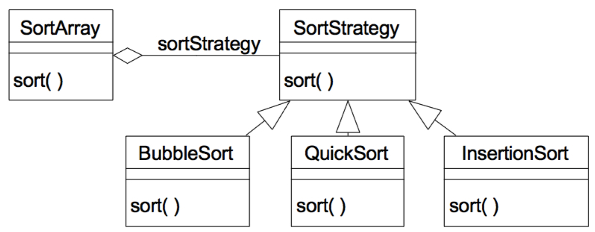
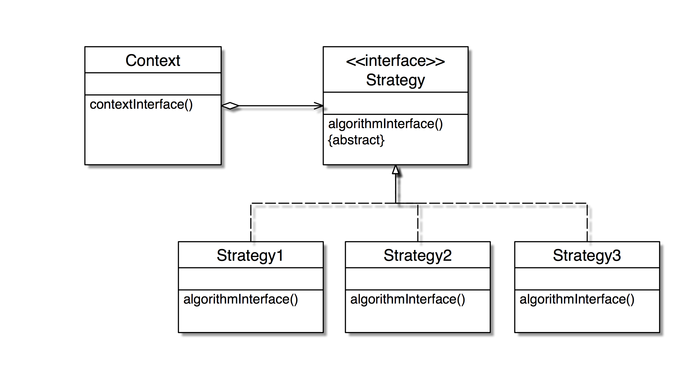

# Strategy

> 今天用這個方法，明天用更好的方法。方法的運用不斷的演進，隨心所欲，不影響基盤的運作。

### Intent 目的
Define a `family of algorithms`, encapsulate each one, and make them `interchangeable`. Strategy lets the algorithm vary independently from clients that use it. 

定義一群演算法，將每一個封裝成一個類別且使之可互換。使用 Strategy 讓演算法獨立於使用者。

### Motivation 動機

在很多種情況我們都會用到策略樣式。假設我們開發一個應用程式，其中會對某個陣列做排序。也許我們一開始會用氣泡排序法，且知道以後這個演算法可以改善，例如用 quick sort, selection sort。我們不希望抽換這些排序方法的時候會對其他程式造成影響，也就是說，我們應該符合 OCP 原則。我們該怎麼設計？

Solution: 使用strategy 設計樣式，將各種不同的排序抽象出來：




### Structure




### Sort Example

```java
//the abstract strategy class
interface Sort {
    int[] Sort(int []); 
}

//the context class- it will use strategy
class Context {
	int[] d;
    private SortStrategy sortStrategy; 
    public Context(SortStrategy s) {
        this.sortStrategy = s;
    } 
    public int[] doSort() {
        return this.sortStrategy.sort(d);
    }
}

class QuickSort implements SortStrategy {
    public int[] sort(int[] d) {
    	//do ....
    	return ...
    }
} 

class SelectionSort implements SortStrategy {
    public int[] sort(int[] d) {
    	//do ....
    	return ...
    }
} 

//main program to test
class StrategyExample {
    public static void main(String[] args) {
        Context context; 
        context = new Context(new QuickSort());
        int[] resultA = context.doSort(); 

        context = new Context(new SelectionSort());
        int[] resultA = context.doSort(); 

    }
}
```

#### Benefits 優點
- 消除大量的 if-else 等判斷句。過去我們可能用 if 來改變要使用的演算法。採用策略樣式，我們透過多型來達到此目的，避免過多的判斷句。
- 演算法的動態抽換。

#### Liabilities 缺點
- 此設計會造成比較多的類別。過去用 if 造成一個很大的方法，用 Strategy 可以避免這個大方法，但類別就會多一些。
- 所有的演算法必須符合相同的介面。因為有一個抽象的策略類別被繼承，大家都要實作相同的介面。


### LayoutManager Example

Java 的 GUI 容器物件也是利用策略設計樣式來改變它的排版的。

```java
Frame f = new Frame(); 
f.setLayout(new FlowLayout()); 
f.add(new Button(“Press”)); 
```
上述的 FlowLayout 就是一個 Strategy, 其他的 layout 例如 BorderLayout, GridLayout 等也都是具體的策略類別。

### Validator/Verifier Example

驗證器。各種不同的輸入需要做不同的驗證，我們可以把驗證器獨立於輸入元件，這樣輸入元件就可以客製化的設計驗證器了。

> 例如生日格式的驗證、電話格式的驗證等都需要特別的驗證方式。

```java
myTextField.setInputVerifier(new MyInputVerifier());
```
我們自己設計一個 verifier: 

```java
public class MyInputVerifier extends InputVerifier {
    public boolean verify(JComponent input) {
        String text = ((JTextField) input).getText();
        try {
            BigDecimal value = new BigDecimal(text);
            return (value.scale() <= Math.abs(2)); 
        } catch (NumberFormatException e) {
            return false;
        }
    }
}
```

## 比較 ##

Strategy 是換骨，Decorator 是換皮