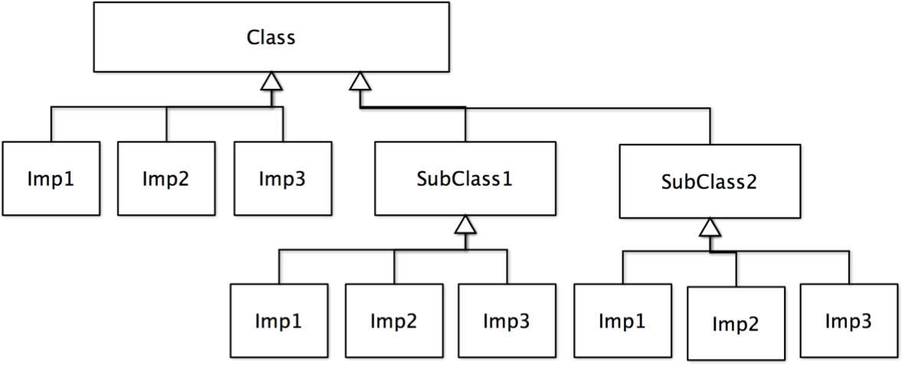
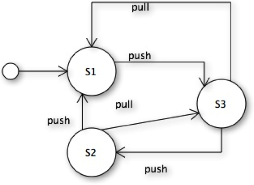

#Design Pattern Lab

> 唯有身歷其中，才能體會其中的道理。

##Abstract Factory

###1. 鞋子工廠
鞋子工廠，一定要製造鞋身(shoes body)、鞋帶(shoes strap)、鞋底(shoes bottom)三個零件，不同型態的鞋子，例如運動鞋(sport shoes) 、休閒鞋(leisure shoes)、皮鞋 (leather shoes) 都會用到不同型態的零件。假設製造鞋子流程都是固定的，寫在 makeShoes() 方法中，而我們也希望重用這樣的流程，不想因為製造不同的鞋子就換修改到 makeShoes 的程式，因此我們採用 *Abstract Factory* 來設計。

- 請畫出此系統的架構 (UML)
- 請撰寫此程式

> Hint: 不同的鞋子有不同的工廠製造。

## Adaptor

### 1. Dummy
某一個 client 程式只認識類別 A 內的方法 m()，但目前 m() 這演算法已經有更好的作法提供在 library 的 B.op() 中。設計一個 adaptor 類別來解決這個問題吧！

> Hint: 什麼是 Target, 什麼是 Adaptee要先訂出來。

### 2. IEAdaptor
Java 過去的集合型態（collection）都實踐 Enumeration 的介面，但新版的則開始使用 Iterator  的介面，我們需要一個 Iterator 轉 Enumeration 的 Adaptor，請設計之。

```java
	interface Iterator {
	   boolean hasNext();
	   boolean next();
	   remove();
	}
	
	interface Enumeration {
	   boolean hasMoreElement();
	   boolean nextElement();
	}
```	
> Hint: iterator 扮演 Target 角色; Enumeration 扮演 Adaptee 角色
> 
> remove() 怎麼轉過去?
> 
> adaptor 的設計和OCP 的原則有何關係。

## Bridge

### 1. Refactoring to Bridge
把以下設計 (design without bridge) 的設計改成有 bridge 的設計



### 2. Shape
圖形(Shape)可以有很多種：正方形(Square)、圓形(Circle)、三角形(Triangle)。畫圖有很多方法：Draw2D、Draw3D。請用 Bridge 來設計此問題。

> Hint: 除了把結構化出來，要記得把重要的『method』也寫出來

```java
//partial code for reference
abstract class Shape {

	public abstract void draw();
	
	protected void drawLine(int a, int b) {
		imp.drawLine(a, b);
	}
}
```

## Chain of responsibility

### 1. 軟體公司
公司內有若干不同的角色，當遇到技術問題時解決的順序是：programmer, designer, architect。遇到管理問題的解決順序是：programmer, analyzer, manager, CEO。請利用 chain of responsibility 的方式來解決此問題。

	interface handle {
	   public void handleTech();
	   public void handleMgmt();
	}


##Composite

### 1. 大學
大學下有很多的院（college）、系所（department）或一二級行政單位（level1Office, level2Office），院下面可以有系所；一級行政單位包含二級單位。當我們詢問該單位的人數時，會回傳該單位的人數及其所包含之單位的人數。

- 請應用 Composite 來設計此問題。(畫出 UML 圖)
— 要注意院不能包含二級單位。一級行政單位不能包含系。

> Hint: (1) 先找出什麼是複合物件。(2) 透過 ArrayList 幫你做複合物件該做的事。

> 想想看：(1) 一級單位能加上系所嗎？如果不能該怎麼解決？(2) 如果系所下面包含學程，這個架構怎麼改？會符合 OCP 原則嗎？

### 2. Graphic
Ellipse, Rectangle, GraphicList 等三個類別，都實作了 Graphic 此介面，並且遵循了 Composite 設計樣式，請寫出 Ellipse, Rectangle, GraphicList 的關鍵程式碼。(GraphicList 是複合物件)

```java
	interface Graphic {
	   public void draw();
	}
```
	
> Hint: 在設計之前，先想想看 Composite 設計樣式包含哪些角色，對應於此問題的哪些物件？

### 3. Menu
餐廳的菜單有很多菜色，有時候顧客會單點，有時候會選擇套餐。顧客詢問菜色時我們會回傳該菜色的介紹，同理套餐也是如此：會回傳該套餐內所有菜色的介紹。請應用 composite 來設計此問題。

##Decorator

###1. Dummy
有一個物件 A 可以從三方面（或更多）去擴充，分別為 X, Y。假設 X 方面可以有 X1, X2 兩種選項，Y 有 Y1, Y2, Y3 兩種選項。

1. 若以 Decorator 設計樣式來設計，該如何設計？請寫出一個簡易的 demo 程式
2. 若改以 Strategy 設計樣式來設計，請寫出一個簡易的 demo 程式
3. 以繼承的方法來設計，需要設計多少類別?


## Factory method 

###1. Dummy
一個 Company 會產生一個零件物件 Product，但我們希望 Company 可以把物件的生成延遲到子類別 CompanyX 再決定零件物件的形態。請設計之。

> Hint: Company 內會有一個 createProduc() 的方法。

###2. Pizza
你可以從一個 PizzaStore 訂購 pizza 。PizzaStore 收到一個訂單後會先準備 pizza，烘培 pizza，切割 pizza，最後是包裝起來。

- prepare the pizza (pizza.prepare())
- bake the pizza (pizza.bake())
- cut the pizza (pizza.cut())
- box the pizza (pizza.box())

不同的 PizzaStore 賣不同的 pizza，但這個程序是不變的，請使用**工廠方法**來設計這個系統。

> Hint: 也就是說，不同 PizzaStore "生產" 不同的物件。


##Mediator

###1. Dummy
有三個 button 分別是 b1, b2, b3, reset
- 當 按下 b1 時，b2 與 b3 disable
- 當 按下 b2 時，b1 disable, b3 enable
- 當 按下 b3 時，b1 enable, b2 disable
- 當按下 reset 時，所有鍵都變成 enable

請利用 Mediator 設計樣式來設計此程式。


##Model-View-Controller

###1. Dummy
Counter 是 Model; CounterController 是控制器，可以改變 Counter 值; CounterViewer  是一個 View 可以呈現 Counter 的值。
- CounterController 每隔五秒會產生亂數修改 model 的值。
- 請寫出程式碼，便檢驗 model 的值改變後多個介面可以呈現改變。請注意 Counter 與 View 之間要用 Observable 的架構。

> 悄悄話：順道練習一下 java 怎麼『每隔五秒鐘』作一件事吧！

###2. 象棋系統
採用 MVC 的架構設計一個象棋系統：
- ChessGame 是一個 model 物件，記錄著目前棋局的狀態
- ChessPanel 讓玩家移動棋子，是一個會改變 ChessGame 狀態的 controller 物件
- GameViewer 讓觀眾觀看棋局的介面，『張三已經加入世界大賽』、『遊戲結束，李四獲勝』等。另外也可以看到狀態：created, playing, game over 等狀態。


## Observer

### 1. 象棋系統
假設你設計一個象棋遊戲，遊戲狀態有 waiting, started, end 三個狀態。當狀態改變時會傳給多個介面，如 PlayerView, CustomerView, AllGameStatusView 等三個介面做呈現。

1. 請透過 java 的 Observable 來設計此問題。
2. 若 ChessGame 本身已經繼承 Game, 無法在繼承 Observable, 該怎麼辦？

> Hint: (1) 假設三個 method 會改變到遊戲的狀態，並且會把狀態傳給 Observer。(2) 委託是個好東西

### 2. 股票
股票（Stock）價格改變後，相關的看盤物件(StockBoard, StockView)會做更新。

1. 請以 java.util.Observable 的 方式來設計此一系統
2. 不要透過繼承 observable 的方式來實踐 Observer 設計樣式。透過 delegation 的方式委託給 observable 來間接實踐 observable
3. 不用 java.util.Observable, 將 Observable 的功能直接寫在 Stock 中，並自己建立一個 Observer 的介面。 

> 悄悄話：畫一個美美的看盤GUI 物件吧，順道練習一下 Java 的繪圖。

## Proxy

### 1. 大使
大使（Ambassador） 是一個國家（Country）的駐外代表，當有人民（People）需要幫忙時（requestHelp）時，會由大使做初步的處理。如果事情很複雜時（isComplex為 true），則會請求國家幫忙。請利用  Proxy pattern 設計此問題。


## Singleton

### 1. RadioManager
請利用 Singleton 設計樣式設計一個 RadioManager 類別。

> 悄悄話：很多 RadioManager 在一個系統會有困擾吧，聲音都打架了。

### 2. USB
類別 USB 最多只能產生 5 個實體。請利用 Singleton 設計樣式的概念設計此類別，請寫出必要的程式碼。

> 悄悄話：千萬別設計五個變數...

### 3. Car

Car 有子類別 Bicycle 和  Motor，如果我們一次只能有一個 Car (如果產生 Bicycle 就不能再產生 Motor 物件；反之亦然)。請利用 Singleton 設計樣式設計此程式。

> Hint: Singleton with hierarchy

> 悄悄話：Car 是抽象類別或 Car 不是抽象類別都各作一遍吧，會有驚喜。

## State

### 1. Dummy
有一個物件 A，當它接受到訊息 request ，所表現出來的行為取決於他目前的狀態 s1, s2, s3。狀態轉移如下：

- s1--> s2
- s2--> s3
- s3--> s1

狀態的個數在日後可能是會變動的，所以我們不想要固定在物件 A 中。請用 State 設計樣式來設計此程式。

### 2. 狀態轉移圖
以下是物件 Context 的狀態行為，請用 *State* design pattern 設計之。



## Strategy

### 1. Dummy
某個物件 A 會用到某個演算法 X 來達成某個功能，但它知道這個演算法未來有很大的改善空間，所以想把它獨立出來。請用 Stragegy 來設計。

### 2. Sort
DataList 類別利用陣列 data 儲存10 個整數，同時利用排序來對資料來做排序，排序的方法可能是 BubbleSort, SelectionSort, QuickSort 等，請利用 Strategy design pattern 來設計此程式。

> 悄悄話：趁機把不同的排序演算法再練習一下吧！

### 3. Google map
Google map 在安排路徑實有很多的方法：最短路徑、最快路徑、免塞車路徑、快速道路路徑。以後可能還會有更多的路徑的方法。請用 Strategy 來設計此問題。

