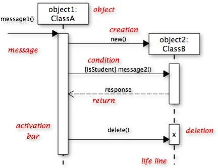
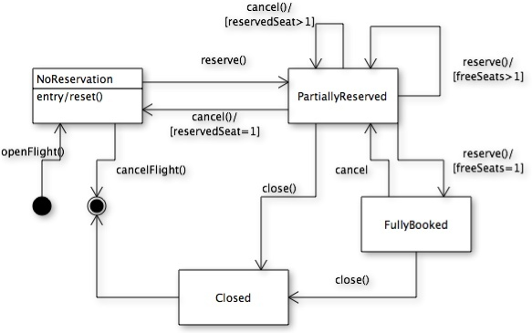
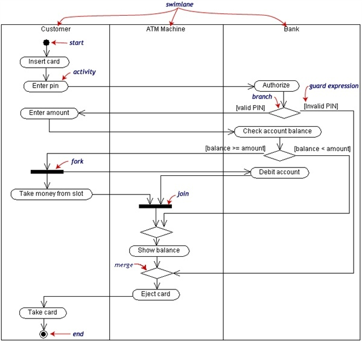
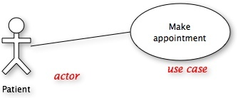

# UML Basics

UML 設計圖幾乎已經是軟體工程的標準，為什麼需要設計，有幾個原因
。圖形的呈現方式
。系統的說明必須要從各種不同的角度
。圖形有助於溝通
。土星十常侍媽的抽象化

## Class diagram

## Mapping class diagram to Java

###Class 

####Abstract Class

	abstract class {
	}

####Parameterized Class

	ArraayList<People>

####Utility Class

<<Utility>>

	class xxx {
		public static void operation1();
		public static void operation2();
	}

####Visibility for Attributes and Operations

####Class Scope Attributes and Operations

---
###Associations

####Bi-directional associations

###Uni-directional associations

####Association roles

####Association Multiplicity

####Association class

####Reflexive Associations

---
###Whole part relationship

####Aggregation

####Composition

---
###Generalization and specialization

####Interfaces and Realizes Relationships

####Generalization

####Multiple Inheritance

## Sequence diagram

## State transition diagram

## Activity diagram

## Use caes diagram

