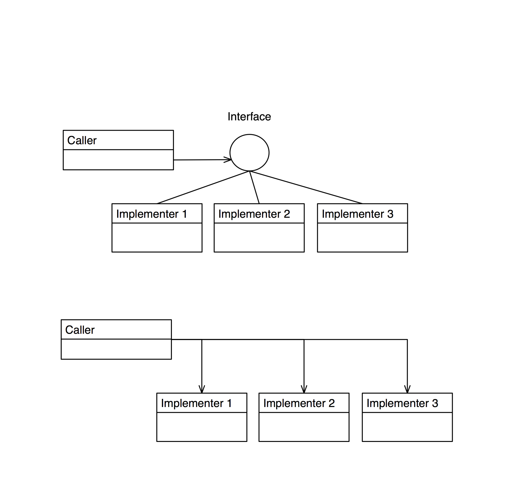
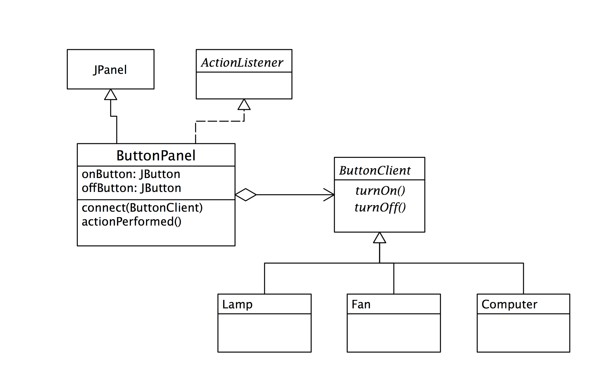

# Principle

## Single Responsibility Principle (SRP)

**A class should have only one reason to change**

一個類別應該只有一個理由去改變。意思是：不要把一堆不相關的功能塞在一個類別內，這樣會造成這個類別的內聚力很差。一個類別應該只有一個改變的理由。

Responsibility

- What a class does
Every class should have a single responsibility, and that responsibility should be entirely encapsulated by the class. 

All its services should be narrowly aligned with that responsibility.
- The more a class does, the more likely it will change
- The more a class changes, the more likely we will introduce bugs

Cohesion and Coupling
- Cohesion – How closely related are the different responsibilities of a module
- Coupling – How much one module relies on another
- Goal is low coupling and high cohesion

Example
- A module that compiles and prints a report. 
- Can be changed for two reasons. 
- First, the content of the report can change. 
-- one substantive 內在的本質
- Second, the format of the report can change. 
-- one cosmetic 外在的顯示

## DRY—Don’t Repeat Yourself Principle

**Every piece of knowledge should have a single, unambiguous, authoritative representation within a system**

**資料或是計算（知識）應該只存在一個地方，不要造成重複**

重複是邪惡的（很容易出錯）Duplication is evil!

Why?
- Things change
- If you have the same thing in several places, when you change one, you have to change all the others
And you can’t always find them all!

What not to duplicate
- Data
	- If you represent the same data in two places (or in two ways), you have just taken on the job of keeping the two representations in agreement
- Code
	- If you code the same task in two places (or in two ways), you have just taken on the job of keeping the two code segments in agreement

Copy-paste programming

- Suppose, as you are coding, you find you need to do the same thing as you did somewhere else
- So you take this shortcut: you copy and paste code
Later you find you need to do almost the same thing again
- So you copy the code, paste it in, and adjust it
Later still, you find you need to change that code

Which copies are the same, and which almost the same?

- Never take a shortcut when you’re in a hurry!
- How to avoid copy-paste
- Often the best solution is to write a method
- Call the method whenever you want to perform the computation
- There is nothing wrong with short methods

If you want to do almost the same thing, parameterize (add parameters to) the method

Abstract your methods to superclass

**Example: Point**

Suppose you have this class:

	class Point {
    	 double x, y;
	     ...
	}

And you discover that some of your users want to have polar coordinates (ρ and θ)

You can’t discard x and y, because the class is already in use
So you end up with double x, y, rho, theta;
Now what if a user changes, say, x?
Redoing the Point example, I
Suppose you had started with:

	class Point {
		private double x, y;
		void setX(double x) { this.x = x; }
		void setY(double y) { this.y = y; }
		double getX() { return x; }
		double getY() { return y; }
	}

極座標可以由絕對座標計算出來，所以不要在用額外的欄位去儲存：需要的時候在計算即可。

To add ρ and θ:
Do not add fields rho and theta; instead, do

	double getRho() { 
		return Math.sqrt(x*x + y*y); 
	}
	double getTheta() { 
		return Math.acos(x / rho); 
	}

	void setRho(double rho) {
    	 x = rho * Math.cos(theta);
	     y = rho * Math.sin(theta);
	}
	void setTheta(double theta) {
    	 x = rho * Math.cos(theta);
	     y = rho * Math.sin(theta);
	}

## Favor Composition Over Inheritance

When there is an IS-A relationship, use inheritance. Otherwise, use composition.

不要一味的使用繼承，只是為了達到程式碼的重用。只有當兩者真的有 IS-A 的關係時才使用繼承。

###Inheritance vs. Composition

Composition

- Method of reuse in which new functionality is obtained by creating an object composed of other objects
- The new functionality is obtained by delegating functionality to one of the objects being composed

For example:

- Aggregation - when one object owns or is responsible for another object and both objects have identical lifetimes (GoF)
- Containment - a special kind of composition in which the contained object is hidden from other objects and access to the contained object is only via the container object (Coad)

**Advantages/Disadvantages Of Composition**

- "Black-box" reuse, since internal details of contained objects are not visible
- Contained objects are accessed by the containing class solely through their interfaces
- Good encapsulation
- Dynamic binding
- The composition can be defined dynamically at run-time through objects acquiring references to other objects of the same type

Disadvantages:
- Resulting systems tend to have more objects
- Interfaces must be carefully defined in order to use many different objects as composition blocks

###Inheritance
- Method of reuse in which new functionality is obtained by extending the implementation of an existing object
- The generalization class (the superclass) explicitly captures the common attributes and methods
- The specialization class (the subclass) extends the implementation with additional attributes and methods

####Advantages/Disadvantages of Inheritance

Advantages:
- New implementation is easy, since most of it is inherited
Easy to modify or extend the implementation being reused

Disadvantages:
- "White-box" reuse, since internal details of superclasses are often visible to subclasses
- Subclasses may have to be changed if the implementation of the superclass changes
- Breaks encapsulation
- Static binding
- Implementations inherited from superclasses can not be changed at runtime
- Inheritance break encapsulation

**Inheritance may cause code duplication**

## Program To An Interface, Not An Implementation

儘量使用 Interface 來設計系統，來降低兩模組之間的耦合度

下圖可以看到兩個設計的不同，上圖使用介面，其耦合度是低的。下圖耦合度就高了。如果今天多了一個實作（implementer），Caller 的程式碼就需要變動。

Interfaces
- An interface is the set of methods one object knows it can invoke on another object
- An object can have many interfaces. (Essentially, an interface is a subset of all the methods that an object implements).
- A type is a specific interface of an object
- Different objects can have the same type and the same object can have many different types
- An object is known by other objects only through its interface
In a sense, interfaces express "is a kind of" in a very limited way as "is a kind of that supports this interface"
Interfaces are the key to pluggability!

介面都有『供需兩端』

- 供：提供介面的實作
- 需：呼叫介面

####Implementation Inheritance vs. Interface Inheritance

Implementation Inheritance (Class Inheritance) - an object's implementation is defined in terms of another's objects implementation

Interface Inheritance (Subtyping) - describes when one object can be used in place of another object
C++ can perform interface inheritance by inheriting from a pure abstract class

Java has a separate language construct for interface inheritance - the Java interface

Java's interface construct makes it easier to express and implement designs that focus on object interfaces

Benefits Of Interface
- Clients are unaware of the specific class of the object they are using
- One object can be easily replaced by another
- Object connections need not be hardwired to an object of a specific class, thereby increasing flexibility
- Loosens coupling
- Increases likelihood of reuse

Disadvantages:
- Modest increase in design complexity

Loosen Coupling

	Interface Example
		public interface IManeuverable {
			public void left();
			public void right();
			public void forward();
			public void reverse();
			public void climb();
			public void dive();
			public void setSpeed(double speed);
			public double getSpeed();
		}

	public class Car
		implements IManeuverable { 
		// Code here. 
	}

	public class Boat implements IManeuverable { 
			// Code here. 
		}

	public class Submarine implements IManeuverable { 
		// Code here. 
	}

This method is some other class can maneuver the vehicle without being concerned about what it actually is (car, boat, submarine or whatever!)

	public void travel(IManeuverable vehicle) {
		vehicle.setSpeed(35.0);
		vehicle.forward();
		vehicle.left();
		vehicle.climb();
	}

介面是一種規範-- 要求實作者要履行的規範。繼承則完全享受實作重用

## The Open-Closed Principle:

**Open for extension, close for modification**

**擁抱擴充，避免修改**
	
or

**We should attempt to design modules that never need to be changed**

Modules that conform to the OCP meet two criteria:
- Open For Extension - The behavior of the module can be extended to meet new requirements
- Closed For Modification - the source code of the module is not allowed to change

How can we do this?
- Abstraction
- Polymorphism
- Inheritance
- Interfaces

It is not possible to have all the modules of a software system satisfy the OCP, but we should attempt to minimize the number of modules that do not satisfy it

The Open-Closed Principle is really the heart of object-orineted design conformance to this principle yields the greatest level of reusability and maintainability

Example

	public double totalPrice(Part[] parts) {
		double total = 0.0;
		for (int i=0; i<parts.length; i++) {
			total += parts[i].getPrice();
		}
		return total;
	}

If Part is a base class or an interface and polymorphism is being used, then this class can easily accommodate new types of parts without having to be modified!

It conforms to the OCP

But if the policy is changed

	public double totalPrice(Part[] parts) {
		double total = 0.0;
		for (int i=0; i<parts.length; i++) {
			if (parts[i] instanceof Motherboard)
				total += (1.45 * parts[i].getPrice());
			else if (parts[i] instanceof Memory)
				total += (1.27 * parts[i].getPrice());
			else
				total += parts[i].getPrice();
		}
	   return total;
	}

**Does this conform to the OCP? No way!**

Every time the Accounting Department comes out with a new pricing policy, we have to modify the totalPrice() method! It is not Closed For Modification. 
Obviously, policy changes such as that mean that we have to modify code somewhere, so what could we do?

Solution 2: Here are example Part and ConcretePart classes:

	// Class Part is the superclass for all parts.

	public class Part {
		private double basePrice;
		public void setPrice(double price) {basePrice = price;}
		public double getPrice() { return basePrice;}
	}

	// Class ConcretePart implements a part for sale.
	// Pricing policy explicit here!

	public class ConcretePart extends Part {
		public double getPrice() {
			// return (1.45 * basePrice); //Premium
			return (0.90 * basePrice); //Labor Day Sale
		}
	}
	
Solution 3

A better idea is to have a PricePolicy class which can be subclassed to provide different pricing policies:

	/**
		*This Part class now has a contained PricePolicy object.
	*/
	public class Part {
		private PricePolicy pricePolicy;
		public void setPricePolicy(PricePolicy policy) {
			pricePolicy =policy;
		}
		public void setPrice(double price) {
			pricePolicy.setPrice(price);
		}
		public double getPrice() { 
			return pricePolicy.getPrice();
		}
	}
	/**
		*Class PricePolicy is the superclass for all price policies.
	*/
	public class PricePolicy {
		private double basePrice;
		public void setPrice(double price) {
			basePrice = price;
		}
		public double getPrice() { 
			return basePrice;
		}
	}
	/**
		*Class SalePrice implements a sale pricing policy.
	*/
	public class SalePrice extends PricePolicy{
		private double discount;
		public void setDiscount(double discount){
		  this.discount =discount; }
	    public double getPrice() { return (basePrice * discount);
	    }
	}

It may look like all we have done is to defer the problem to another class. But with this solution we can dynamically set pricing policies at run time by changing the Price object that an existing Part object refers to.

## The Liskov Substitution Principle:

The Liskov Substitution Principle (LSP) seems obvious given all we know about polymorphism

For example:

	public void drawShape(Shape s) {
		// Code here.
	}

The drawShape method should work with any subclass of the Shape superclass (or, if Shape is a Java interface, it should work with any class that implements the Shape interface)
But we must be careful when we implement subclasses to insure that we do not unintentionally violate the LSP

LSP Example

Consider the following Rectangle class:

	public class Rectangle {
		private double width;
		private double height;
		public Rectangle(double w, double h) {
			width = w;
			height = h;
		}
		public double getWidth() {return width;}
		public double getHeight() {return height;}
		public void setWidth(double w) {width = w;}
		public void setHeight(double h) {height = h;}
		public double area() {return (width * height);
	}

Now, had about a Square class? 

Clearly, a square is a rectangle, so the Square class should be derived from the Rectangle class, right? Let's see!
Observations:

A square does not need both a width and a height as attributes
but it will inherit them from Rectangle anyway. 
So, each Square object wastes a little memory, but this is not a major concern.

The inherited setWidth() and setHeight() methods are not really appropriate for a Square, since the width and height of a square are identical. 

So we'll need to override setWidth() and setHeight(). Having to override these simple methods is a clue that this might not be an appropriate use of inheritance!

Here's the Square class:

	// A Square class.
	public class Square extends Rectangle {
		public Square(double s) {super(s, s);}
		public void setWidth(double w) {
			super.setWidth(w);
			super.setHeight(w);
		}
		public void setHeight(double h) {
			super.setHeight(h);
			super.setWidth(h);
		}
	}

Everything looks good. But check this out!

    public class TestRectangle {
        // Define a method that takes a Rectangle reference.
        public static void testLSP(Rectangle r) {
            r.setWidth(4.0);
            r.setHeight(5.0);
            System.out.println("Width is 4.0 and Height is 5.0" +", so Area is " + r.area());
            if (r.area() == 20.0)
                System.out.println("Looking good!\n");
            else
                System.out.println("Huh?? What kind of rectangle is this??\n");
    }

    public static void main(String args[]) {
		//Create a Rectangle and a Square
		Rectangle r = new Rectangle(1.0, 1.0);
		Square s = new Square(1.0);
		// Now call the method above. According to the
		// LSP, it should work for either Rectangles or
		// Squares. Does it??
		testLSP(r);
		testLSP(s);
		}
	}

Test program output:

	Width is 4.0 and Height is 5.0, so Area is 20.0 Looking good!

	Width is 4.0 and Height is 5.0, so Area is 25.0

Huh?? What kind of rectangle is this?? 
Looks like we violated the LSP!

What's the problem here? The programmer of the testLSP() method made the reasonable assumption that changing the width of a Rectangle leaves its height unchanged.

Passing a Square object to such a method results in problems, exposing a violation of the LSP

The Square and Rectangle classes look self consistent and valid. Yet a programmer, making reasonable assumptions about the base class, can write a method that causes the design model to break down

**Solutions:** can not be viewed in isolation, they must also be viewed in terms of reasonable assumptions that might be made by users of the design

A mathematical square might be a rectangle, but a Square object is not a Rectangle object, because the behavior of a Square object is not consistent with the behavior of a Rectangle object!

**Behaviorally, a Square is not a Rectangle! A Square object is not polymorphic with a Rectangle object.**

Is a tree a graph?

The Liskov Substitution Principle
- The LSP makes it clear that the ISA relationship is all about behavior
- all subclasses must conform to the behavior that clients expect of the base classes they use
- A subtype must have no more constraints than its base type, since the subtype must be usable anywhere the base type is usable
- If the subtype has more constraints than the base type, there would be uses that would be valid for the base type, but that would violate one of the extra constraints of the subtype and thus violate the LSP!
- The guarantee of the LSP is that a subclass can always be used wherever its base class is used!

## Interface Segregation Principle 

**Be not cohesive/Interface pollution must be broken up into groups of methods, every group serves a different set of client **

Door example

Door is an abstract class (or interface)

	abstract class Door {
  	 public abstract void Lock();
	   public abstract void Unlock();
  	 public abstract bool IsDoorOpen();
	}

TimedDoor needs to sound an alarm when the door has been left open for too long.
	class Timer {
  	 public void regsiter(int timeout, TimerClient client);
	}

When an object wishes to be informed about a timeout, it calls the Register function of the Timer. 
- timeOut: the time of the timeout
- TimerClient: whose TimeOut function will be called when the timeout expires.

TimedDoor need Timer to inform the timeOut.

	class TimerClient {
  	 public abstract void TimeOut();
	}

How can we get the TimerClient class to communicate with the TimedDoor class so that the code in the TimedDoor can be notified of the timeout?

Door class now depends upon TimerClient. 
Problems
- Not all varieties of Door need timing.
Indeed, the original Door abstraction had nothing whatever to do with timing
- The interface of Door has been polluted with an interface that it does not require. 
- It has been forced to incorporate this interface solely for the benefit of one of its subclasses.

If we change the requirement …

To allows each derivative of TimerClient to know which timeout request is being responded to.

	class Timer {
    	public void abstract Regsiter(int timeout, int 	timeOutId, TimerClient client);
    	
	class TimerClient {
    	public abstract  void TimeOut (int timeOutId);
	}
	
This change will affect all the users of TimeClient (Door must implement TimeOut(int timeOutId)

Interface Segregation Principle
- Door and TimerClient represent interfaces that are used by completely different clients.
- Timer uses TimerClient, and classes that manipulate doors use Door. 
- Clients should not be forced to depend upon interfaces that they do not use
- Many client-specific interfaces are better than one general purpose interface

The depended interface between classes must be minimized.
Different type clients use different interface.
Separation through Interface Implementation

	class TimedDoor extends Door implements TimerClient
	
	Interface TimerClient {
    	 public abstract void TimeOut(int timeOutId);
	}

## Dependency Inversion Principle

**High level modules (Abstractions) should not depend upon low level modules. All should depend on abstraction.**

"Structured" methods of the 1970's tended towards a "top-down decomposition", encouraged high-level modules to depend on modules written at a lower level of abstraction. 

High level modules contain the important policy decisions and business models of an application. 
When these modules depend upon the lower level modules, then changes to the lower level modules can have direct effects upon them; and can force them to change.

This predicament is absurd! 
It is the high level modules that ought to be forcing the low level modules to change. 
It is the high level modules that should take precedence over the lower level modules.
it is high level modules that we want to be able to reuse.

Example: “Copy” Program (1)

The “Copy” module encapsulates an policy to be reused.
The “Copy” module is not reusable in any context which does not involve a keyboard or a printer. 

	void Copy() {
	   int c;
	   while ((c = ReadKeyboard()) != EOF)
	   WritePrinter(c);
	}
	
Example: “Copy” Program (2)

A new program copy keyboard characters to a disk file.
To reuse the “Copy” since it encapsulates the high level policy

It knows how to copy characters from a source to a sink.

the “Copy” module is dependent upon the “Write Printer” module, and so cannot be reused in the new context.

	void Copy(outputDevice dev){
	   int c;
	   while ((c = ReadKeyboard()) != EOF)
    	    if (dev == printer) WritePrinter(c);
	        else WriteDisk(c);
	}

As more devices must participate in the copy program, the “Copy” module will be added with if/else statements and will be dependent upon many lower level modules. 

It will eventually become rigid and fragile.

Example: “Copy” Program (4)

	class Reader {   public int Read();   }
	class Writer  {    public void Write(char);  }
	void Copy(Reader r, Writer w)  {
	   int c;
	   while((c=r.Read()) != EOF)
    	  w.Write(c);
	}
	

	class Lamp {
    	public void TurnOn();
	    public void TurnOff();
	}
	
	class Button {
	    private Lamp itsLamp;
	    public Button(Lamp l) {itsLamp =l; }
    	public void Detect() {
        	bool buttonOn = GetPhysicalState();
	        if (buttonOn)   itsLamp.TurnOn();
    	    else     itsLamp.TurnOff();
	    }
	}
	
	abstract class ButtonClient {
    	public void TurnOn();
	    public void TurnOff();
	}
	abstract class Button {
    	private ButtonClient  itsClient;
	    public Button(ButtonClient b) {
    	    itsClient = b;
	    }
    	public void Detect() {
        	 bool buttonOn = GetState();
	         if (buttonOn)      itsClient.TurnOn();
    	     else         itsClient.TurnOff();
    	}
	    public bool GetState();
	}

	class Lamp extends ButtonClient {
    	public  void TurnOn();
	    public  void TurnOff();
	}

	class ButtonImplementation extends Button {
    	public ButtonImplementaton(ButtonClient b);
	    public bool GetState();
	}

## Don’t Talk to Strangers

	To avoid knowing about the structure of indirect objects
	
Solution
- Direct objects are a client’s familiars, indirect objects are strangers 
- Avoid have classes make direct calls to other classes with which they have an indirect relationship

Objects that don’t satisfy one of the following constraints are considered to be strangers
- The same object (this)
- An object that is passed as a parameter to a method
- An object to which one of its instance variable directly refers
- An object created by the object

Don’t Talk to Strangers(2)
- Example: a partial class diagram for the POS system

Don’t Talk to Strangers(3)

##Lab

###DIP principle

####1. ButtonPanel
應用 DIP 的原則設計一個通用型的開關器 (ButtonPanel)，它可以用來開關所有電器 -- 只要它有 on, off 的介面。注意 ButtonPanel 不能『看到很多』 不同型態的電器，這樣偶合力會很高，也違反的 DIP 的原則。

**悄悄話:** 這個例子可以作為一個『GUI 元件』設計的練習。如果這個例子會作了，你大概可以設計軟體元件了。

Hint: 參考這個設計吧。

###OCP principle

####1. 變動的計價策略
某物品的價格會隨著計價策略的改變而變動，例如假期特價（HolidaySale）或特別特價（SpecialSale）。為了符合 OCP 原則，我們應該把計價抽離出來設計。
- 請畫出 UML 設計圖。
- 請寫出程式碼

以下為 Company 的主程式。

	class Company {
	   public double totalPrice(Part[] parts) {
    	 double total = 0.0;
	     for (int i=0; i<parts.length; i++) {
    	 	total += parts[i].getPrice();
	     }
    	 return total;
	   }
	} 
	
**Hint: ** 建立一個抽象的計價類別 PricePolicy; 並且讓 Part 類別放一個這個類別的參考。
